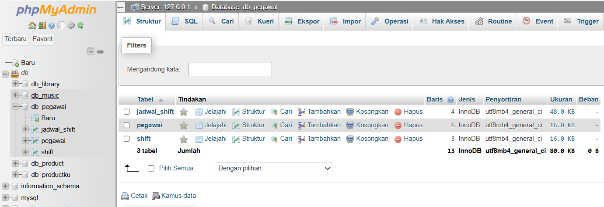
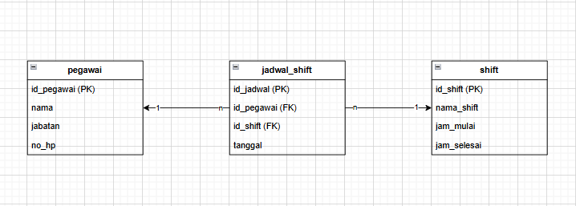

# TP7DPBO2425C2
Saya Fauzia Rahma Nisa mengerjakan Tugas Praktikum 7 dalam mata kuliah Desain dan Pemrograman Berdasarkan Objek untuk keberkahanNya maka saya tidak melakukan kecurangan seperti yang telah dispesifikasikan. Aamiin.

**1. Tema Website**

   Website ini dibuat untuk mengelola jadwal kerja pegawai pada perusahaan atau toko. Fitur utama:
   - Mengelola data pegawai (tambah, edit, hapus).
   - Mengelola data shift (hanya dapat diedit karena shift bersifat tetap yaitu pagi, siang, malam).
   - Mengelola jadwal shift pegawai (tambah, edit, hapus), dengan menghubungkan pegawai dan shift pada tanggal tertentu.
     
Tujuan: mempermudah proses penjadwalan kerja, mencegah bentrok shift antarpegawai, dan membantu monitoring jadwal kerja dengan lebih efisien.

**2. Struktur Database**

a. Tabel pegawai (Menyimpan informasi pegawai)

- id_pegawai INT : Primary Key, auto increment
- nama VARCHAR(100) : Nama pegawai
- jabatan VARCHAR(50) : Posisi pegawai
- no_hp VARCHAR(15) : Nomor HP pegawai

b. Tabel shift (Menyimpan unformasi shift kerja)

- id_shift INT : Primary Key, auto increment
- nama_shift VARCHAR(50) : Nama shift (Pagi, Siang, Malam)
- jam_mulai	TIME : Jam mulai shift
- jam_selesai TIME : Jam selesai shift

c. Tabel jadwal_shift (Menyimpan jadwal shift pegawai)

- id_jadwal	INT : Primary Key, auto increment
- id_pegawai INT : Foreign Key ke pegawai(id_pegawai)
- id_shift INT : Foreign Key ke shift(id_shift)
- tanggal DATE : Tanggal shift

Relasi : 

- Satu pegawai bisa punya banyak jadwal shift, tapi satu baris jadwal_shift cuma bisa punya satu pegawai.
- Satu shift bisa muncul di banyak jadwal shift, tapi satu jadwal_shift cuma punya satu shift.

**3. flow code**

Website ini menggunakan konsep Object-Oriented Programming (OOP). Pertama, koneksi ke database dibuat melalui file config/db.php menggunakan PDO, sehingga semua query ke database aman. Setiap tabel memiliki class masing-masing di folder class/. Class Pegawai mengatur semua operasi CRUD untuk data pegawai, class Shift hanya bisa mengedit waktu shift, sedangkan class JadwalShift mengatur CRUD untuk jadwal shift pegawai. Dengan begitu, setiap operasi database terorganisir dan mudah dipanggil melalui method di masing-masing class.

File index.php menjadi titik masuk utama. Di sini, semua class dipanggil dan digunakan untuk menangani input dari user, baik itu add, update, maupun delete data. index.php juga mengatur routing sederhana: berdasarkan parameter $_GET['page'], website akan menampilkan halaman Pegawai, Shift, atau Jadwal Shift.

Di sisi tampilan, folder view/ berisi file PHP untuk setiap halaman. Form untuk menambah atau mengedit data ditampilkan menggunakan HTML, sedangkan tabel menampilkan semua data dari database. Untuk jadwal shift, data pegawai dan shift digabungkan menggunakan JOIN sehingga terlihat informasi lengkap pegawai, shift, dan waktunya.

CSS di file style.css memastikan tampilan website rapi dan mudah digunakan. Tombol aksi, form, dan tabel diberikan style agar user dapat dengan mudah menavigasi dan melakukan operasi CRUD tanpa kebingungan.

**4. Dokumentasi**

Klik dibawah ini untuk menihat dokumentasi 

